# Определение перспективного тарифа для телеком-компании

# Описание проекта

Заказчик исследования — федеральный оператор сотовой связи «Мегалайн». 

Цель исследования — определить, какой из двух тарифов приносит больше денег: «Смарт» и «Ультра». 

Данные для исследования — небольшая выборка из 500 клиентов, содержащая следующую информацию: кто они, откуда, каким тарифом пользуются, сколько звонков и сообщений каждый отправил за 2018 год. 

ОПИСАНИЕ ТАРИФОВ

**Тариф «Смарт»:**
- Ежемесячная плата: 550 рублей;
- Включено 500 минут разговора, 50 сообщений и 15 Гб интернет-трафика;
- Стоимость услуг сверх тарифного пакета: минута разговора 3 рубля, сообщение 3 рубля, 1 Гб интернет-трафика 200 рублей.

**Тариф «Ультра»:**
- Ежемесячная плата: 1950 рублей;
- Включено 3000 минут разговора, 1000 сообщений и 30 Гб интернет-трафика;
- Стоимость услуг сверх тарифного пакета: минута разговора 1 рубль, сообщение 1 рубль, 1 Гб интернет-трафика 150 рублей.

*«Мегалайн» всегда округляет секунды до минут, а мегабайты — до гигабайт. Каждый звонок округляется отдельно: даже если он длился всего 1 секунду, будет засчитан как 1 минута.
Для веб-трафика отдельные сессии не считаются. Вместо этого общая сумма за месяц округляется в бо́льшую сторону. Если абонент использует 1025 мегабайт в этом месяце, с него возьмут плату за 2 гигабайта. Неиспользованные за предыдущий месяц звонки, смс, интернет на следующий месяц не переносятся.*

## Получение данных


```python
# Импорт библиотек:
import pandas as pd
import numpy as np
from scipy import stats as st
import plotly.express as px
import math
import matplotlib.pyplot as plt
import seaborn as sns
```

### Информация о звонках


```python
try:
    calls = pd.read_csv('C:/datasets/yandex_projects/telecom/calls.csv')
except:
    calls = pd.read_csv('/datasets/calls.csv')
calls.info()
```

    <class 'pandas.core.frame.DataFrame'>
    RangeIndex: 202607 entries, 0 to 202606
    Data columns (total 4 columns):
     #   Column     Non-Null Count   Dtype  
    ---  ------     --------------   -----  
     0   id         202607 non-null  object 
     1   call_date  202607 non-null  object 
     2   duration   202607 non-null  float64
     3   user_id    202607 non-null  int64  
    dtypes: float64(1), int64(1), object(2)
    memory usage: 6.2+ MB


```python
calls.head(5)
```


<div>
<style scoped>
    .dataframe tbody tr th:only-of-type {
        vertical-align: middle;
    }

    .dataframe tbody tr th {
        vertical-align: top;
    }

    .dataframe thead th {
        text-align: right;
    }
</style>
<table border="1" class="dataframe">
  <thead>
    <tr style="text-align: right;">
      <th></th>
      <th>id</th>
      <th>call_date</th>
      <th>duration</th>
      <th>user_id</th>
    </tr>
  </thead>
  <tbody>
    <tr>
      <th>0</th>
      <td>1000_0</td>
      <td>2018-07-25</td>
      <td>0.00</td>
      <td>1000</td>
    </tr>
    <tr>
      <th>1</th>
      <td>1000_1</td>
      <td>2018-08-17</td>
      <td>0.00</td>
      <td>1000</td>
    </tr>
    <tr>
      <th>2</th>
      <td>1000_2</td>
      <td>2018-06-11</td>
      <td>2.85</td>
      <td>1000</td>
    </tr>
    <tr>
      <th>3</th>
      <td>1000_3</td>
      <td>2018-09-21</td>
      <td>13.80</td>
      <td>1000</td>
    </tr>
    <tr>
      <th>4</th>
      <td>1000_4</td>
      <td>2018-12-15</td>
      <td>5.18</td>
      <td>1000</td>
    </tr>
  </tbody>
</table>
</div>


Таблица calls содержит следующую информацию:
- id — уникальный номер звонка;
- call_date — дата звонка;
- duration — длительность звонка в минутах;
- user_id — идентификатор пользователя, сделавшего звонок.

Видим, что в датасете присутстуют звонки с нулевой продолжительностью. Известно, что это не ошибка: нулями обозначены пропущенные звонки, поэтому их не нужно удалять.

### Информация об интернет-сессиях


```python
try:
    internet = pd.read_csv('C:/datasets/yandex_projects/telecom/internet.csv')
except:
    internet = pd.read_csv('/datasets/internet.csv')
internet.info()
```

    <class 'pandas.core.frame.DataFrame'>
    RangeIndex: 149396 entries, 0 to 149395
    Data columns (total 5 columns):
     #   Column        Non-Null Count   Dtype  
    ---  ------        --------------   -----  
     0   Unnamed: 0    149396 non-null  int64  
     1   id            149396 non-null  object 
     2   mb_used       149396 non-null  float64
     3   session_date  149396 non-null  object 
     4   user_id       149396 non-null  int64  
    dtypes: float64(1), int64(2), object(2)
    memory usage: 5.7+ MB


```python
internet.head(5)
```


<div>
<style scoped>
    .dataframe tbody tr th:only-of-type {
        vertical-align: middle;
    }

    .dataframe tbody tr th {
        vertical-align: top;
    }

    .dataframe thead th {
        text-align: right;
    }
</style>
<table border="1" class="dataframe">
  <thead>
    <tr style="text-align: right;">
      <th></th>
      <th>Unnamed: 0</th>
      <th>id</th>
      <th>mb_used</th>
      <th>session_date</th>
      <th>user_id</th>
    </tr>
  </thead>
  <tbody>
    <tr>
      <th>0</th>
      <td>0</td>
      <td>1000_0</td>
      <td>112.95</td>
      <td>2018-11-25</td>
      <td>1000</td>
    </tr>
    <tr>
      <th>1</th>
      <td>1</td>
      <td>1000_1</td>
      <td>1052.81</td>
      <td>2018-09-07</td>
      <td>1000</td>
    </tr>
    <tr>
      <th>2</th>
      <td>2</td>
      <td>1000_2</td>
      <td>1197.26</td>
      <td>2018-06-25</td>
      <td>1000</td>
    </tr>
    <tr>
      <th>3</th>
      <td>3</td>
      <td>1000_3</td>
      <td>550.27</td>
      <td>2018-08-22</td>
      <td>1000</td>
    </tr>
    <tr>
      <th>4</th>
      <td>4</td>
      <td>1000_4</td>
      <td>302.56</td>
      <td>2018-09-24</td>
      <td>1000</td>
    </tr>
  </tbody>
</table>
</div>


Таблица internet:
- id — уникальный номер сессии;
- mb_used — объём потраченного за сессию интернет-трафика (в мегабайтах);
- session_date — дата интернет-сессии;
- user_id — идентификатор пользователя.

### Информация  о сообщениях


```python
try:
    messages = pd.read_csv('C:/datasets/yandex_projects/telecom/messages.csv')
except:
    messages = pd.read_csv('/datasets/messages.csv')
messages.info()
```

    <class 'pandas.core.frame.DataFrame'>
    RangeIndex: 123036 entries, 0 to 123035
    Data columns (total 3 columns):
     #   Column        Non-Null Count   Dtype 
    ---  ------        --------------   ----- 
     0   id            123036 non-null  object
     1   message_date  123036 non-null  object
     2   user_id       123036 non-null  int64 
    dtypes: int64(1), object(2)
    memory usage: 2.8+ MB


```python
messages.head(5)
```


<div>
<style scoped>
    .dataframe tbody tr th:only-of-type {
        vertical-align: middle;
    }

    .dataframe tbody tr th {
        vertical-align: top;
    }

    .dataframe thead th {
        text-align: right;
    }
</style>
<table border="1" class="dataframe">
  <thead>
    <tr style="text-align: right;">
      <th></th>
      <th>id</th>
      <th>message_date</th>
      <th>user_id</th>
    </tr>
  </thead>
  <tbody>
    <tr>
      <th>0</th>
      <td>1000_0</td>
      <td>2018-06-27</td>
      <td>1000</td>
    </tr>
    <tr>
      <th>1</th>
      <td>1000_1</td>
      <td>2018-10-08</td>
      <td>1000</td>
    </tr>
    <tr>
      <th>2</th>
      <td>1000_2</td>
      <td>2018-08-04</td>
      <td>1000</td>
    </tr>
    <tr>
      <th>3</th>
      <td>1000_3</td>
      <td>2018-06-16</td>
      <td>1000</td>
    </tr>
    <tr>
      <th>4</th>
      <td>1000_4</td>
      <td>2018-12-05</td>
      <td>1000</td>
    </tr>
  </tbody>
</table>
</div>


Таблица messages:
- id — уникальный номер сообщения;
- message_date — дата сообщения;
- user_id — идентификатор пользователя, отправившего сообщение.

### Информация о тарифах


```python
try:
    tariffs = pd.read_csv('C:/datasets/yandex_projects/telecom/tariffs.csv')
except:
    tariffs = pd.read_csv('/datasets/tariffs.csv')
tariffs.info()
```

    <class 'pandas.core.frame.DataFrame'>
    RangeIndex: 2 entries, 0 to 1
    Data columns (total 8 columns):
     #   Column                 Non-Null Count  Dtype 
    ---  ------                 --------------  ----- 
     0   messages_included      2 non-null      int64 
     1   mb_per_month_included  2 non-null      int64 
     2   minutes_included       2 non-null      int64 
     3   rub_monthly_fee        2 non-null      int64 
     4   rub_per_gb             2 non-null      int64 
     5   rub_per_message        2 non-null      int64 
     6   rub_per_minute         2 non-null      int64 
     7   tariff_name            2 non-null      object
    dtypes: int64(7), object(1)
    memory usage: 256.0+ bytes


```python
tariffs.head(5)
```


<div>
<style scoped>
    .dataframe tbody tr th:only-of-type {
        vertical-align: middle;
    }

    .dataframe tbody tr th {
        vertical-align: top;
    }

    .dataframe thead th {
        text-align: right;
    }
</style>
<table border="1" class="dataframe">
  <thead>
    <tr style="text-align: right;">
      <th></th>
      <th>messages_included</th>
      <th>mb_per_month_included</th>
      <th>minutes_included</th>
      <th>rub_monthly_fee</th>
      <th>rub_per_gb</th>
      <th>rub_per_message</th>
      <th>rub_per_minute</th>
      <th>tariff_name</th>
    </tr>
  </thead>
  <tbody>
    <tr>
      <th>0</th>
      <td>50</td>
      <td>15360</td>
      <td>500</td>
      <td>550</td>
      <td>200</td>
      <td>3</td>
      <td>3</td>
      <td>smart</td>
    </tr>
    <tr>
      <th>1</th>
      <td>1000</td>
      <td>30720</td>
      <td>3000</td>
      <td>1950</td>
      <td>150</td>
      <td>1</td>
      <td>1</td>
      <td>ultra</td>
    </tr>
  </tbody>
</table>
</div>


Таблица tariffs:
- tariff_name — название тарифа;
- rub_monthly_fee — ежемесячная абонентская плата в рублях;
- minutes_included — количество минут разговора в месяц, включённых в абонентскую плату;
- messages_included — количество сообщений в месяц, включённых в абонентскую плату;
- mb_per_month_included — объём интернет-трафика, включённого в абонентскую плату (в мегабайтах);
- rub_per_minute — стоимость минуты разговора сверх тарифного пакета (например, если в тарифе 100 минут разговора в месяц, то со 101 минуты будет взиматься плата);
- rub_per_message — стоимость отправки сообщения сверх тарифного пакета;
- rub_per_gb — стоимость дополнительного гигабайта интернет-трафика сверх тарифного пакета (1 гигабайт = 1024 мегабайта).


```python
# Переведем МБ в ГБ:
tariffs['mb_per_month_included'] = tariffs['mb_per_month_included'] / 1024
tariffs.columns = ['messages_included', 'gb_per_month_included', 'minutes_included',
       'rub_monthly_fee', 'rub_per_gb', 'rub_per_message', 'rub_per_minute',
       'tariff']
```


```python
tariffs.head(5)
```


<div>
<style scoped>
    .dataframe tbody tr th:only-of-type {
        vertical-align: middle;
    }

    .dataframe tbody tr th {
        vertical-align: top;
    }

    .dataframe thead th {
        text-align: right;
    }
</style>
<table border="1" class="dataframe">
  <thead>
    <tr style="text-align: right;">
      <th></th>
      <th>messages_included</th>
      <th>gb_per_month_included</th>
      <th>minutes_included</th>
      <th>rub_monthly_fee</th>
      <th>rub_per_gb</th>
      <th>rub_per_message</th>
      <th>rub_per_minute</th>
      <th>tariff</th>
    </tr>
  </thead>
  <tbody>
    <tr>
      <th>0</th>
      <td>50</td>
      <td>15.0</td>
      <td>500</td>
      <td>550</td>
      <td>200</td>
      <td>3</td>
      <td>3</td>
      <td>smart</td>
    </tr>
    <tr>
      <th>1</th>
      <td>1000</td>
      <td>30.0</td>
      <td>3000</td>
      <td>1950</td>
      <td>150</td>
      <td>1</td>
      <td>1</td>
      <td>ultra</td>
    </tr>
  </tbody>
</table>
</div>


### Информация о пользователях


```python
try:
    users = pd.read_csv('C:/datasets/yandex_projects/telecom/users.csv')
except:
    users = pd.read_csv('/datasets/users.csv')
users.info()
```

    <class 'pandas.core.frame.DataFrame'>
    RangeIndex: 500 entries, 0 to 499
    Data columns (total 8 columns):
     #   Column      Non-Null Count  Dtype 
    ---  ------      --------------  ----- 
     0   user_id     500 non-null    int64 
     1   age         500 non-null    int64 
     2   churn_date  38 non-null     object
     3   city        500 non-null    object
     4   first_name  500 non-null    object
     5   last_name   500 non-null    object
     6   reg_date    500 non-null    object
     7   tariff      500 non-null    object
    dtypes: int64(2), object(6)
    memory usage: 31.4+ KB


```python
users.head(5)
```


<div>
<style scoped>
    .dataframe tbody tr th:only-of-type {
        vertical-align: middle;
    }

    .dataframe tbody tr th {
        vertical-align: top;
    }

    .dataframe thead th {
        text-align: right;
    }
</style>
<table border="1" class="dataframe">
  <thead>
    <tr style="text-align: right;">
      <th></th>
      <th>user_id</th>
      <th>age</th>
      <th>churn_date</th>
      <th>city</th>
      <th>first_name</th>
      <th>last_name</th>
      <th>reg_date</th>
      <th>tariff</th>
    </tr>
  </thead>
  <tbody>
    <tr>
      <th>0</th>
      <td>1000</td>
      <td>52</td>
      <td>NaN</td>
      <td>Краснодар</td>
      <td>Рафаил</td>
      <td>Верещагин</td>
      <td>2018-05-25</td>
      <td>ultra</td>
    </tr>
    <tr>
      <th>1</th>
      <td>1001</td>
      <td>41</td>
      <td>NaN</td>
      <td>Москва</td>
      <td>Иван</td>
      <td>Ежов</td>
      <td>2018-11-01</td>
      <td>smart</td>
    </tr>
    <tr>
      <th>2</th>
      <td>1002</td>
      <td>59</td>
      <td>NaN</td>
      <td>Стерлитамак</td>
      <td>Евгений</td>
      <td>Абрамович</td>
      <td>2018-06-17</td>
      <td>smart</td>
    </tr>
    <tr>
      <th>3</th>
      <td>1003</td>
      <td>23</td>
      <td>NaN</td>
      <td>Москва</td>
      <td>Белла</td>
      <td>Белякова</td>
      <td>2018-08-17</td>
      <td>ultra</td>
    </tr>
    <tr>
      <th>4</th>
      <td>1004</td>
      <td>68</td>
      <td>NaN</td>
      <td>Новокузнецк</td>
      <td>Татьяна</td>
      <td>Авдеенко</td>
      <td>2018-05-14</td>
      <td>ultra</td>
    </tr>
  </tbody>
</table>
</div>


Таблица users:
- user_id — уникальный идентификатор пользователя;
- first_name — имя пользователя;
- last_name — фамилия пользователя;
- age — возраст пользователя (годы);
- reg_date — дата подключения тарифа (день, месяц, год);
- churn_date — дата прекращения пользования тарифом (если значение пропущено, то тариф ещё действовал на момент выгрузки данных);
- city — город проживания пользователя;
- tariff — название тарифного плана.

Видно, что в стобце churn_date (дата прекращения пользования тарифом) имеются пропуски. Известно, что если значение пропущено, то тариф ещё действовал на момент выгрузки данных. Значит у 462 человек тариф еще действует.

## Подготовка данных

### Приведение данных к нужным типам


```python
# Заменим во всех таблицах тип данных даты на  datetime:

calls['call_date'] = pd.to_datetime(calls['call_date'], format='%Y-%m-%d')
calls['month'] = calls['call_date'].dt.month

internet['session_date'] = pd.to_datetime(internet['session_date'], format='%Y-%m-%d')
internet['month'] = internet['session_date'].dt.month

messages['message_date'] = pd.to_datetime(messages['message_date'], format='%Y-%m-%d')
messages['month'] = messages['message_date'].dt.month
```

### Исправление ошибок в данных

Мы знаем, что оператор округляет значения минут в большую сторону, поэтому округлим до большего значения и приведем к целочисленному типу после округления:


```python
calls['duration'] = np.ceil(calls['duration'])
```

### Расчеты для каждого пользователя


```python
# Создадим одинаковый столбец во всех таблицах, чтобы можно было объединить в одну таблицу:

calls['call_date'] = pd.to_datetime(calls['call_date'], format='%Y-%m-%d')
calls['month'] = calls['call_date'].dt.month

internet['session_date'] = pd.to_datetime(internet['session_date'], format='%Y-%m-%d')
internet['month'] = internet['session_date'].dt.month

messages['message_date'] = pd.to_datetime(messages['message_date'], format='%Y-%m-%d')
messages['month'] = messages['message_date'].dt.month
```

#### Количество сделанных звонков и израсходованных минут разговора по месяцам


```python
# Найдем количество сделанных звонков и израсходованных минут разговора по месяцам для каждого пользователя:
calls_pivot = pd.pivot_table(calls, index=['user_id', 'month'], values = ['duration'], aggfunc=('sum', 'count')).reset_index()
calls_pivot.columns = ['user_id', 'month', ( 'calls_count'), ( 'min_sum')]
display(calls_pivot)
```


<div>
<style scoped>
    .dataframe tbody tr th:only-of-type {
        vertical-align: middle;
    }

    .dataframe tbody tr th {
        vertical-align: top;
    }

    .dataframe thead th {
        text-align: right;
    }
</style>
<table border="1" class="dataframe">
  <thead>
    <tr style="text-align: right;">
      <th></th>
      <th>user_id</th>
      <th>month</th>
      <th>calls_count</th>
      <th>min_sum</th>
    </tr>
  </thead>
  <tbody>
    <tr>
      <th>0</th>
      <td>1000</td>
      <td>5</td>
      <td>22</td>
      <td>159.0</td>
    </tr>
    <tr>
      <th>1</th>
      <td>1000</td>
      <td>6</td>
      <td>43</td>
      <td>172.0</td>
    </tr>
    <tr>
      <th>2</th>
      <td>1000</td>
      <td>7</td>
      <td>47</td>
      <td>340.0</td>
    </tr>
    <tr>
      <th>3</th>
      <td>1000</td>
      <td>8</td>
      <td>52</td>
      <td>408.0</td>
    </tr>
    <tr>
      <th>4</th>
      <td>1000</td>
      <td>9</td>
      <td>58</td>
      <td>466.0</td>
    </tr>
    <tr>
      <th>...</th>
      <td>...</td>
      <td>...</td>
      <td>...</td>
      <td>...</td>
    </tr>
    <tr>
      <th>3169</th>
      <td>1498</td>
      <td>10</td>
      <td>41</td>
      <td>247.0</td>
    </tr>
    <tr>
      <th>3170</th>
      <td>1499</td>
      <td>9</td>
      <td>9</td>
      <td>70.0</td>
    </tr>
    <tr>
      <th>3171</th>
      <td>1499</td>
      <td>10</td>
      <td>68</td>
      <td>449.0</td>
    </tr>
    <tr>
      <th>3172</th>
      <td>1499</td>
      <td>11</td>
      <td>74</td>
      <td>612.0</td>
    </tr>
    <tr>
      <th>3173</th>
      <td>1499</td>
      <td>12</td>
      <td>69</td>
      <td>492.0</td>
    </tr>
  </tbody>
</table>
<p>3174 rows × 4 columns</p>
</div>


#### Количество отправленных сообщений по месяцам


```python
# Посчитаем количество отправленных смс по месяцам для каждого пользователя:
message_pivot = pd.pivot_table(messages, index=['user_id', 'month'], values = ['id'], aggfunc='count').reset_index()
message_pivot.columns = ['user_id', 'month', 'messages_count']
display(message_pivot)
```


<div>
<style scoped>
    .dataframe tbody tr th:only-of-type {
        vertical-align: middle;
    }

    .dataframe tbody tr th {
        vertical-align: top;
    }

    .dataframe thead th {
        text-align: right;
    }
</style>
<table border="1" class="dataframe">
  <thead>
    <tr style="text-align: right;">
      <th></th>
      <th>user_id</th>
      <th>month</th>
      <th>messages_count</th>
    </tr>
  </thead>
  <tbody>
    <tr>
      <th>0</th>
      <td>1000</td>
      <td>5</td>
      <td>22</td>
    </tr>
    <tr>
      <th>1</th>
      <td>1000</td>
      <td>6</td>
      <td>60</td>
    </tr>
    <tr>
      <th>2</th>
      <td>1000</td>
      <td>7</td>
      <td>75</td>
    </tr>
    <tr>
      <th>3</th>
      <td>1000</td>
      <td>8</td>
      <td>81</td>
    </tr>
    <tr>
      <th>4</th>
      <td>1000</td>
      <td>9</td>
      <td>57</td>
    </tr>
    <tr>
      <th>...</th>
      <td>...</td>
      <td>...</td>
      <td>...</td>
    </tr>
    <tr>
      <th>2712</th>
      <td>1498</td>
      <td>10</td>
      <td>42</td>
    </tr>
    <tr>
      <th>2713</th>
      <td>1499</td>
      <td>9</td>
      <td>11</td>
    </tr>
    <tr>
      <th>2714</th>
      <td>1499</td>
      <td>10</td>
      <td>48</td>
    </tr>
    <tr>
      <th>2715</th>
      <td>1499</td>
      <td>11</td>
      <td>59</td>
    </tr>
    <tr>
      <th>2716</th>
      <td>1499</td>
      <td>12</td>
      <td>66</td>
    </tr>
  </tbody>
</table>
<p>2717 rows × 3 columns</p>
</div>


#### Объем израсходованного интернет-трафика по месяцам


```python
# Переведем Мб в Гб
internet['gb_used'] = internet['mb_used']/1024

# Посчитаем объем израсходованного интернет-трафика по месяцам для каждого пользователя:
internet_pivot = pd.pivot_table(internet, index=['user_id', 'month'], values = ['gb_used'], aggfunc='sum').reset_index()
display(internet_pivot)
```


<div>
<style scoped>
    .dataframe tbody tr th:only-of-type {
        vertical-align: middle;
    }

    .dataframe tbody tr th {
        vertical-align: top;
    }

    .dataframe thead th {
        text-align: right;
    }
</style>
<table border="1" class="dataframe">
  <thead>
    <tr style="text-align: right;">
      <th></th>
      <th>user_id</th>
      <th>month</th>
      <th>gb_used</th>
    </tr>
  </thead>
  <tbody>
    <tr>
      <th>0</th>
      <td>1000</td>
      <td>5</td>
      <td>2.200674</td>
    </tr>
    <tr>
      <th>1</th>
      <td>1000</td>
      <td>6</td>
      <td>22.689229</td>
    </tr>
    <tr>
      <th>2</th>
      <td>1000</td>
      <td>7</td>
      <td>13.675430</td>
    </tr>
    <tr>
      <th>3</th>
      <td>1000</td>
      <td>8</td>
      <td>13.726494</td>
    </tr>
    <tr>
      <th>4</th>
      <td>1000</td>
      <td>9</td>
      <td>14.227451</td>
    </tr>
    <tr>
      <th>...</th>
      <td>...</td>
      <td>...</td>
      <td>...</td>
    </tr>
    <tr>
      <th>3198</th>
      <td>1498</td>
      <td>10</td>
      <td>20.097031</td>
    </tr>
    <tr>
      <th>3199</th>
      <td>1499</td>
      <td>9</td>
      <td>1.802490</td>
    </tr>
    <tr>
      <th>3200</th>
      <td>1499</td>
      <td>10</td>
      <td>17.371592</td>
    </tr>
    <tr>
      <th>3201</th>
      <td>1499</td>
      <td>11</td>
      <td>17.542295</td>
    </tr>
    <tr>
      <th>3202</th>
      <td>1499</td>
      <td>12</td>
      <td>12.749590</td>
    </tr>
  </tbody>
</table>
<p>3203 rows × 3 columns</p>
</div>


####  Помесячная выручка с каждого пользователя


```python
# Объединим в единый датасет таблицы звонков, смс, интернета, тарифов и данные пользователей:
data = calls_pivot.merge(message_pivot, on=['user_id', 'month'],  how='outer')
data = data.merge(internet_pivot, on=['user_id', 'month'], how='outer')
data = data.merge(users, on=['user_id'], how='outer')
data = data.merge(tariffs, on=['tariff'],  how='outer')

# Уберем ненужные для анализа столбцы:
data.drop(['age', 'first_name', 'last_name', 'churn_date', 'reg_date'], axis='columns', inplace=True)

# Заполним пропуски нулями:
columns = ['calls_count', 'min_sum','messages_count','gb_used']
for col in columns:
     data[col] = data[col].fillna(value='0').astype('int')
        
# Посчитаем помесячную выручку с каждого пользователя:
def sales (data):
    min_sum=data['min_sum']
    messages_count=data['messages_count']
    gb_used=data['gb_used']
    rub_monthly_fee =data['rub_monthly_fee']
    
    delta_min= max(((min_sum-data['minutes_included'])*data['rub_per_minute']), 0)
    delta_mess= max(((messages_count-data['messages_included']) * data['rub_per_message']), 0)
    delta_data= max((np.ceil(gb_used)-data['gb_per_month_included'])*data['rub_per_gb'], 0)                
    total = rub_monthly_fee + delta_min + delta_mess + delta_data
                    
    return total
    
data['sales'] = data.apply(sales, axis=1)
data
```


<div>
<style scoped>
    .dataframe tbody tr th:only-of-type {
        vertical-align: middle;
    }

    .dataframe tbody tr th {
        vertical-align: top;
    }

    .dataframe thead th {
        text-align: right;
    }
</style>
<table border="1" class="dataframe">
  <thead>
    <tr style="text-align: right;">
      <th></th>
      <th>user_id</th>
      <th>month</th>
      <th>calls_count</th>
      <th>min_sum</th>
      <th>messages_count</th>
      <th>gb_used</th>
      <th>city</th>
      <th>tariff</th>
      <th>messages_included</th>
      <th>gb_per_month_included</th>
      <th>minutes_included</th>
      <th>rub_monthly_fee</th>
      <th>rub_per_gb</th>
      <th>rub_per_message</th>
      <th>rub_per_minute</th>
      <th>sales</th>
    </tr>
  </thead>
  <tbody>
    <tr>
      <th>0</th>
      <td>1000</td>
      <td>5.0</td>
      <td>22</td>
      <td>159</td>
      <td>22</td>
      <td>2</td>
      <td>Краснодар</td>
      <td>ultra</td>
      <td>1000</td>
      <td>30.0</td>
      <td>3000</td>
      <td>1950</td>
      <td>150</td>
      <td>1</td>
      <td>1</td>
      <td>1950.0</td>
    </tr>
    <tr>
      <th>1</th>
      <td>1000</td>
      <td>6.0</td>
      <td>43</td>
      <td>172</td>
      <td>60</td>
      <td>22</td>
      <td>Краснодар</td>
      <td>ultra</td>
      <td>1000</td>
      <td>30.0</td>
      <td>3000</td>
      <td>1950</td>
      <td>150</td>
      <td>1</td>
      <td>1</td>
      <td>1950.0</td>
    </tr>
    <tr>
      <th>2</th>
      <td>1000</td>
      <td>7.0</td>
      <td>47</td>
      <td>340</td>
      <td>75</td>
      <td>13</td>
      <td>Краснодар</td>
      <td>ultra</td>
      <td>1000</td>
      <td>30.0</td>
      <td>3000</td>
      <td>1950</td>
      <td>150</td>
      <td>1</td>
      <td>1</td>
      <td>1950.0</td>
    </tr>
    <tr>
      <th>3</th>
      <td>1000</td>
      <td>8.0</td>
      <td>52</td>
      <td>408</td>
      <td>81</td>
      <td>13</td>
      <td>Краснодар</td>
      <td>ultra</td>
      <td>1000</td>
      <td>30.0</td>
      <td>3000</td>
      <td>1950</td>
      <td>150</td>
      <td>1</td>
      <td>1</td>
      <td>1950.0</td>
    </tr>
    <tr>
      <th>4</th>
      <td>1000</td>
      <td>9.0</td>
      <td>58</td>
      <td>466</td>
      <td>57</td>
      <td>14</td>
      <td>Краснодар</td>
      <td>ultra</td>
      <td>1000</td>
      <td>30.0</td>
      <td>3000</td>
      <td>1950</td>
      <td>150</td>
      <td>1</td>
      <td>1</td>
      <td>1950.0</td>
    </tr>
    <tr>
      <th>...</th>
      <td>...</td>
      <td>...</td>
      <td>...</td>
      <td>...</td>
      <td>...</td>
      <td>...</td>
      <td>...</td>
      <td>...</td>
      <td>...</td>
      <td>...</td>
      <td>...</td>
      <td>...</td>
      <td>...</td>
      <td>...</td>
      <td>...</td>
      <td>...</td>
    </tr>
    <tr>
      <th>3211</th>
      <td>1489</td>
      <td>9.0</td>
      <td>0</td>
      <td>0</td>
      <td>32</td>
      <td>16</td>
      <td>Санкт-Петербург</td>
      <td>smart</td>
      <td>50</td>
      <td>15.0</td>
      <td>500</td>
      <td>550</td>
      <td>200</td>
      <td>3</td>
      <td>3</td>
      <td>750.0</td>
    </tr>
    <tr>
      <th>3212</th>
      <td>1489</td>
      <td>10.0</td>
      <td>0</td>
      <td>0</td>
      <td>21</td>
      <td>19</td>
      <td>Санкт-Петербург</td>
      <td>smart</td>
      <td>50</td>
      <td>15.0</td>
      <td>500</td>
      <td>550</td>
      <td>200</td>
      <td>3</td>
      <td>3</td>
      <td>1350.0</td>
    </tr>
    <tr>
      <th>3213</th>
      <td>1489</td>
      <td>11.0</td>
      <td>0</td>
      <td>0</td>
      <td>20</td>
      <td>17</td>
      <td>Санкт-Петербург</td>
      <td>smart</td>
      <td>50</td>
      <td>15.0</td>
      <td>500</td>
      <td>550</td>
      <td>200</td>
      <td>3</td>
      <td>3</td>
      <td>950.0</td>
    </tr>
    <tr>
      <th>3214</th>
      <td>1489</td>
      <td>12.0</td>
      <td>0</td>
      <td>0</td>
      <td>35</td>
      <td>16</td>
      <td>Санкт-Петербург</td>
      <td>smart</td>
      <td>50</td>
      <td>15.0</td>
      <td>500</td>
      <td>550</td>
      <td>200</td>
      <td>3</td>
      <td>3</td>
      <td>750.0</td>
    </tr>
    <tr>
      <th>3215</th>
      <td>1371</td>
      <td>NaN</td>
      <td>0</td>
      <td>0</td>
      <td>0</td>
      <td>0</td>
      <td>Омск</td>
      <td>smart</td>
      <td>50</td>
      <td>15.0</td>
      <td>500</td>
      <td>550</td>
      <td>200</td>
      <td>3</td>
      <td>3</td>
      <td>550.0</td>
    </tr>
  </tbody>
</table>
<p>3216 rows × 16 columns</p>
</div>


## Анализ данных выборки по каждому тарифу

### Количество минут разговора в месяц

Определим исходя из выборки, сколько минут разговора требуется пользователям каждого тарифа в месяц.


```python
# Сделаем две выборки, раделенные по тарифам:
data_smart = data.query('tariff == "smart"')
data_ultra = data.query('tariff == "ultra"')

# Построим гистограммы распределения количества минут разговоров по каждому тарифу:
data_smart['min_sum'].hist(alpha = 0.7, range = (0,1400), label="Смарт")
data_ultra['min_sum'].hist(alpha = 0.5, range = (0,1400), label="Ультра")
plt.legend()
plt.title('Распределение количества минут разговора по тарифам')
plt.xlabel('Количество минут')
plt.ylabel('Частота')
plt.show()
```


    
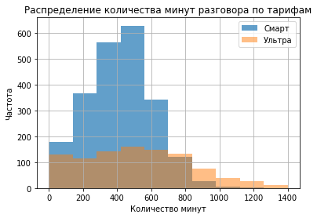
    


Из гистограммы по тарифу Смарт видим, что у нас биноминальное распределение, немного скошенное вправо. Значит, медиана будет чуть меньше среднего.<br>Также из графика распределения видно, что тарифом Ультра пользуется намного меньше людей, чем тарифом Смарт. 
Из гистограммы видно, что чаще всего на тарифе Смарт пользователи тратят примерно 300-400 минут в месяц, а пользователи тарифа Ультра в широком диапазоне от 0 до 800 минут. <br> Согласно тарифам, тариф Смарт включает в себя 500 минут разговора, тогда как тариф Ультра содержит 3000 минут разговора. <br> Таким образом, можно прийти к следующим выводам:
- некоторой части тарифа Смарт приходится доплачивать за дополнительные минуты разговора, т.к. ежемесячный лимит времени на разговоры иногда превышается; 
- среди пользователей тарифа Ультра почти не встречаются абоненты, которые бы доплачивали за дополнительные минуты разговора, т.к.они с большим запасом укладываются в лимит.


```python
# Посчитаем среднее, дисперсию и стандартное октлонение для количества минут разговора по тарифам:
data.pivot_table(index = ['tariff'], values = 'min_sum', aggfunc = ['mean', np.var, np.std] )
```


<div>
<style scoped>
    .dataframe tbody tr th:only-of-type {
        vertical-align: middle;
    }

    .dataframe tbody tr th {
        vertical-align: top;
    }

    .dataframe thead tr th {
        text-align: left;
    }

    .dataframe thead tr:last-of-type th {
        text-align: right;
    }
</style>
<table border="1" class="dataframe">
  <thead>
    <tr>
      <th></th>
      <th>mean</th>
      <th>var</th>
      <th>std</th>
    </tr>
    <tr>
      <th></th>
      <th>min_sum</th>
      <th>min_sum</th>
      <th>min_sum</th>
    </tr>
    <tr>
      <th>tariff</th>
      <th></th>
      <th></th>
      <th></th>
    </tr>
  </thead>
  <tbody>
    <tr>
      <th>smart</th>
      <td>417.747534</td>
      <td>36281.393836</td>
      <td>190.476754</td>
    </tr>
    <tr>
      <th>ultra</th>
      <td>526.089249</td>
      <td>101052.493549</td>
      <td>317.887549</td>
    </tr>
  </tbody>
</table>
</div>


Пользователи тарифа Смарт в среднем разговаривают по телефону 371 минут в месяц. Это обусловлено тем, что в тариф включено лишь 500 минут. Дисперсия составляет 29 тыс минут, а стандартное отклонение - 170 минут.<br>
Пользователи тарифа Ультра в среднем разговаривают по телефону 467 минут в месяц. Причём иногда их разговоры могут достигать 1400 минут в месяц, т.к. в тариф Ультра включено 3000 минут. Дисперсия составляет 80 тыс минут, а стандартное отклонение - 283 минуты.


```python
# Посчитаем и визуализируем среднее для количества минут разговора по месяцам:
calls_mean = data.pivot_table(index='month', columns = 'tariff', values='min_sum', aggfunc = 'mean')
sns.heatmap(calls_mean)
plt.title('Среднее количество минут разговора по тарифам')
plt.xlabel('Тариф')
plt.ylabel('Месяц')
plt.show()
```


    
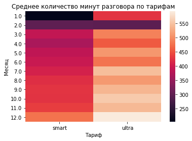
    


Из хитмэпа видно, что с каждым месяцем среднее количество минут разговора в месяц растёт как для тарифа Смарт, так и для тарифа Ультра. <br>За исключением февраля пользователи тарифа Ультра в среднем разговаривают всегда больше, чем пользователи тарифа Смарт. Лишь в феврале они потратили примерно одинаковое количество минут разговора.


```python
# Посчитаем и визуализируем дисперсию для количества минут разговора по месяцам:
calls_var = data.pivot_table(index='month', columns = 'tariff', values='min_sum', aggfunc = (lambda x: round(np.var(x),2)))
sns.heatmap(calls_var)
plt.title('Дисперсия количества минут разговора по тарифам')
plt.xlabel('Тариф')
plt.ylabel('Месяц')
plt.show()
```


    
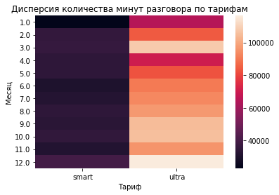
    


Из хитмэпа видно, что с каждым месяцем дисперсия количества минут разговора в месяц также растёт для обоих тарифов. <br>Дисперсия по тарифу Ультра всегда больше, чем по тарифу Смарт.


```python
# Посчитаем и визуализируем стандартное отклонение для количества минут разговора по месяцам:
calls_std = data.pivot_table(index='month', columns = 'tariff', values='min_sum', aggfunc=(lambda x: round(np.std(x),2)))
sns.heatmap(calls_std)
plt.title('Стандартное отклонение количества минут разговора по тарифам')
plt.xlabel('Тариф')
plt.ylabel('Месяц')
plt.show()
```


    

    


Из хитмэпа видно, что с каждым месяцем стандартное отклонение количества минут разговора в месяц также растёт для обоих тарифов. <br>Стандартное отклонение по тарифу Ультра всегда больше, чем по тарифу Смарт.

### Количество сообщений в месяц

Определим исходя из выборки, сколько сообщений отсылают пользователи каждого тарифа в месяц.


```python
# Построим гистограммы распределения количества сообщений по каждому тарифу:
data_smart['messages_count'].hist(alpha = 0.7, range = (0,250), label="Смарт")
data_ultra['messages_count'].hist(alpha = 0.5, range = (0,250), label="Ультра")
plt.legend()
plt.title('Распределение количества сообщений по тарифам')
plt.xlabel('Количество сообщений')
plt.ylabel('Частота')
plt.show()
```


    
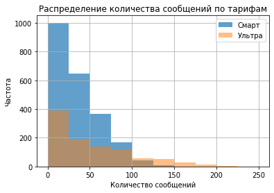
    


В обеих гистограммах биноминальное распределение, скошенное вправо - медиана будет меньше среднего.
Пользователи тарифа Смарт в основном используют до 50 смс в месяц. Однако некоторым польхователям тарифа Смарт не хватает количества смс и им приходится перелачивать. Пользователи тарифа Ультра не переплачивают за смс, так как вполне укладываются в свой лимит 1000 смс при том, что большинство не расходует и 100 смс в месяц.


```python
# Посчитаем среднее, дисперсию и стандартное октлонение для количества сообщений по тарифам:
data.pivot_table(index = ['tariff'], values = 'messages_count', aggfunc = ['mean', np.var, np.std] )
```


<div>
<style scoped>
    .dataframe tbody tr th:only-of-type {
        vertical-align: middle;
    }

    .dataframe tbody tr th {
        vertical-align: top;
    }

    .dataframe thead tr th {
        text-align: left;
    }

    .dataframe thead tr:last-of-type th {
        text-align: right;
    }
</style>
<table border="1" class="dataframe">
  <thead>
    <tr>
      <th></th>
      <th>mean</th>
      <th>var</th>
      <th>std</th>
    </tr>
    <tr>
      <th></th>
      <th>messages_count</th>
      <th>messages_count</th>
      <th>messages_count</th>
    </tr>
    <tr>
      <th>tariff</th>
      <th></th>
      <th></th>
      <th></th>
    </tr>
  </thead>
  <tbody>
    <tr>
      <th>smart</th>
      <td>33.369058</td>
      <td>796.955256</td>
      <td>28.230396</td>
    </tr>
    <tr>
      <th>ultra</th>
      <td>49.313387</td>
      <td>2285.417425</td>
      <td>47.806040</td>
    </tr>
  </tbody>
</table>
</div>


Пользователи тарифа Смарт в среднем отсылают 33 смс в месяц. Это обусловлено тем, что в тариф включено лишь 50 смс. Дисперсия составляет 797 смс, а стандартное отклонение - 28 смс.<br>
Пользователи тарифа Ультра в среднем шлют 49 смс в месяц. Дисперсия составляет 2285 смс, а стандартное отклонение - 47 смс.


```python
# Посчитаем и визуализируем среднее для количества сообщений по месяцам:
messages_mean = data.pivot_table(index='month', columns = 'tariff', values='messages_count', aggfunc = 'mean')
sns.heatmap(messages_mean)
plt.title('Среднее количество сообщений по тарифам')
plt.xlabel('Тариф')
plt.ylabel('Месяц')
plt.show()
```


    
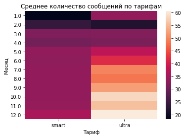
    


Из хитмэпа видно, что с каждым месяцем среднее количество смс в месяц растёт как для тарифа Смарт, так и для тарифа Ультра. <br>За исключением февраля пользователи тарифа Ультра в среднем шлют смс всегда чаще, чем пользователи тарифа Смарт. Лишь в феврале они отослали меньшее количество смс.


```python
# Посчитаем и визуализируем дисперсию для количества сообщений по месяцам:
messages_var = data.pivot_table(index='month', columns = 'tariff', values='messages_count', aggfunc = (lambda x: round(np.var(x),2)))
sns.heatmap(messages_var)
plt.title('Дисперсия количества сообщений по тарифам')
plt.xlabel('Тариф')
plt.ylabel('Месяц')
plt.show()
```


    
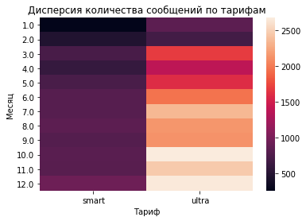
    


Из хитмэпа видно, что с каждым месяцем дисперсия количества смс в месяц также растёт для обоих тарифов. <br>Дисперсия по тарифу Ультра всегда больше, чем по тарифу Смарт.


```python
# Посчитаем и визуализируем стандартное отклонение для количества сообщений по месяцам:
messages_std = data.pivot_table(index='month', columns = 'tariff', values='messages_count', aggfunc=(lambda x: round(np.std(x),2)))
sns.heatmap(messages_std)
plt.title('Стандартное отклонение количества сообщений по тарифам')
plt.xlabel('Тариф')
plt.ylabel('Месяц')
plt.show()
```


    
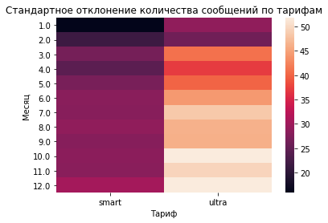
    


Из хитмэпа видно, что с каждым месяцем стандартное отклонение количества смс в месяц также растёт для обоих тарифов. <br>Стандартное отклонение по тарифу Ультра всегда больше, чем по тарифу Смарт.

### Объём интернет-трафика в месяц

Определим исходя из выборки, сколько минут разговора требуется пользователям каждого тарифа в месяц.


```python
# Построим гистограммы распределения количества интернет-трафика по каждому тарифу:
data_smart['gb_used'].hist(alpha = 0.7, range = (0,50), label="Смарт")
data_ultra['gb_used'].hist(alpha = 0.5, range = (0,50), label="Ультра")
plt.legend()
plt.title('Распределение количества интернет-трафика по тарифам')
plt.xlabel('Количество Гб')
plt.ylabel('Частота')
plt.show()
```


    

    


Распределение трафика по тарифу Смарт скошено влево - медиана будет чуть больше среднего. Пользователи тарифа Смарт используют в основном от 10 до 20 ГБ в месяц, при включенном в тариф объеме интернета в 15 ГБ. Следовательно можно сделать вывод , что пользователи зачастую переплачивают.<br>
Распределение трафика по тарифу Ультра больше стремится к нормальному, но немного скошено вправо. Пользователи тарифа Ультра при включенном в 30 ГБ объема интернета, используют от 10 до 30 ГБ. 


```python
# Посчитаем среднее, дисперсию и стандартное октлонение для количества интернет-трафика по тарифам:
data.pivot_table(index = ['tariff'], values = 'gb_used', aggfunc = ['mean', np.var, np.std] )
```


<div>
<style scoped>
    .dataframe tbody tr th:only-of-type {
        vertical-align: middle;
    }

    .dataframe tbody tr th {
        vertical-align: top;
    }

    .dataframe thead tr th {
        text-align: left;
    }

    .dataframe thead tr:last-of-type th {
        text-align: right;
    }
</style>
<table border="1" class="dataframe">
  <thead>
    <tr>
      <th></th>
      <th>mean</th>
      <th>var</th>
      <th>std</th>
    </tr>
    <tr>
      <th></th>
      <th>gb_used</th>
      <th>gb_used</th>
      <th>gb_used</th>
    </tr>
    <tr>
      <th>tariff</th>
      <th></th>
      <th></th>
      <th></th>
    </tr>
  </thead>
  <tbody>
    <tr>
      <th>smart</th>
      <td>15.322870</td>
      <td>33.090863</td>
      <td>5.752466</td>
    </tr>
    <tr>
      <th>ultra</th>
      <td>18.486815</td>
      <td>96.916070</td>
      <td>9.844596</td>
    </tr>
  </tbody>
</table>
</div>


Пользователи тарифа Смарт в среднем трятят 15 Гб интернета в месяц. Это обусловлено тем, что в тариф включено лишь 15 Гб интернета в месяц. Дисперсия составляет 33 Гб, а стандартное отклонение - 5,7 Гб.<br>
Пользователи тарифа Ультра в среднем трятят 18 Гб интернета в месяц. Но есть пользователи, которые используют и до 50 ГБ интенет трафика. Дисперсия составляет 97 Гб, а стандартное отклонение - 9,8 Гб.


```python
# Посчитаем и визуализируем среднее для количества интернет-трафика по месяцам:
gb_mean = data.pivot_table(index='month', columns = 'tariff', values='gb_used', aggfunc = 'mean')
sns.heatmap(gb_mean)
plt.title('Среднее количество интернет-трафика по тарифам')
plt.xlabel('Тариф')
plt.ylabel('Месяц')
plt.show()
```


    
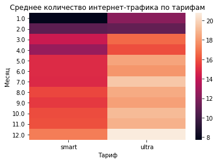
    


Из хитмэпа видно, что с каждым месяцем пользователи обоих тарифов более охотно тратят интернет-трафик. <br>За исключением февраля пользователи тарифа Ультра в среднем используют больше Гб, чем пользователи тарифа Смарт.


```python
# Посчитаем и визуализируем дисперсию для количества интернет-трафика по месяцам:
gb_var = data.pivot_table(index='month', columns = 'tariff', values='gb_used', aggfunc = (lambda x: round(np.var(x),2)))
sns.heatmap(gb_var)
plt.title('Дисперсия количества минут разговора по тарифам')
plt.xlabel('Тариф')
plt.ylabel('Месяц')
plt.show()
```


    
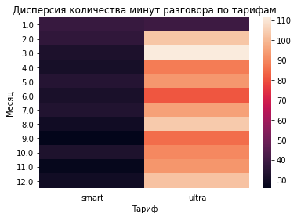
    


Из хитмэпа видно, что с каждым месяцем дисперсия количества интернет-трафика в месяц также растёт для обоих тарифов. Но для тарифа Ультра растёт быстрее. <br>Дисперсия по тарифу Ультра всегда больше, чем по тарифу Смарт.


```python
# Посчитаем и визуализируем стандартное отклонение для количества интернет-трафика по месяцам:
gb_std = data.pivot_table(index='month', columns = 'tariff', values='gb_used', aggfunc=(lambda x: round(np.std(x),2)))
sns.heatmap(gb_std)
plt.title('Стандартное отклонение количества минут разговора по тарифам')
plt.xlabel('Тариф')
plt.ylabel('Месяц')
plt.show()
```


    
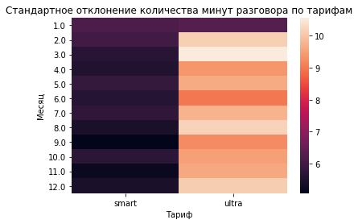
    


Из хитмэпа видно, что для обоих тарифов стандартное отклонение существенно не меняется в течение года.<br>Стандартное отклонение по тарифу Ультра всегда больше, чем по тарифу Смарт.


```python
sns.barplot(x='month', y='sales', data=data, hue = 'tariff')
plt.xlabel('Месяц')
plt.ylabel('Выручка, руб')
plt.title('Средняя выручка по двум тарифам')
plt.show()
```


    
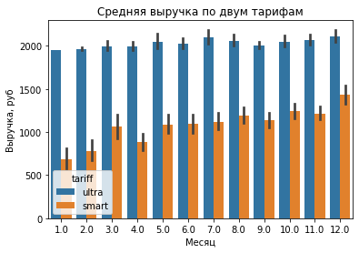
    


```python
data.pivot_table(index = ['tariff'], values = 'sales', aggfunc = 'mean' )
```


<div>
<style scoped>
    .dataframe tbody tr th:only-of-type {
        vertical-align: middle;
    }

    .dataframe tbody tr th {
        vertical-align: top;
    }

    .dataframe thead th {
        text-align: right;
    }
</style>
<table border="1" class="dataframe">
  <thead>
    <tr style="text-align: right;">
      <th></th>
      <th>sales</th>
    </tr>
    <tr>
      <th>tariff</th>
      <th></th>
    </tr>
  </thead>
  <tbody>
    <tr>
      <th>smart</th>
      <td>1172.691031</td>
    </tr>
    <tr>
      <th>ultra</th>
      <td>2049.645030</td>
    </tr>
  </tbody>
</table>
</div>


В среднем выручка от каждого пользователя на тарифе Смарт составила 1 172 руб в месяц при том, что цена тарифа всего 550 руб. Получается, что пользователи тарифа Смарт переплачивают в среднем 622 руб в месяц, т.е. больше, чем стоил их тариф (!) Причем переплата растет от месяца к месяцу к концу года. <br> А по тарифу Ультра средняя выручка составила 2 049 руб в месяц при том, что цена тарифа всего 1950 руб. Их переплата составляет в среднем всего 99 руб.

## Проверка гипотез

### Средняя выручка пользователей тарифов «Ультра» и «Смарт» различаются

Сформируем нулевую гипотезу H0 - средняя выручка пользователей тарифов «Ультра» и «Смарт» не различается.<br>
Сформируем альтернативную гипотезу H1 - Средняя выручка пользователей тарифов «Ультра» и «Смарт» различается.<br>
Критический уровень статистической значимости зададим alpha =0.05, чтобы вероятность правильности нашего вывода была 95% и больше.


```python
sales_smart = data.query('tariff == "smart"')['sales']
sales_ultra = data.query('tariff == "ultra"')['sales']
alpha = .05
results = st.ttest_ind(
    sales_smart, 
    sales_ultra)

print('P-value:', results.pvalue)

if (results.pvalue < alpha):
    print("Отвергаем нулевую гипотезу")
else:
    print("Не получилось отвергнуть нулевую гипотезу")
```

    P-value: 3.0481957189513244e-226
    Отвергаем нулевую гипотезу


Для выбранного уровня значимости нулевая гипотеза не подтвердилась. Следовательно можно сделать вывод, что **средняя выручка пользователей тарифов «Ультра» и «Смарт» различается.**

### Cредняя выручка пользователей из Москвы отличается от выручки пользователей из других регионов

Сформируем нулевую гипотезу H0 - средняя выручка пользователей из Москвы не отличается от выручки пользователей из других регионов.<br>
Сформируем альтернативную гипотезу H1 - средняя выручка пользователей из Москвы отличается от выручки пользователей из других регионов.<br>
Критический уровень статистической значимости также зададим alpha = 0.05.


```python
sales_moscow = data.query('city == "Москва"')['sales']
sales_other = data.query('city != "Москва"')['sales']
from scipy import stats as st
alpha = .05
results = st.ttest_ind(
    sales_moscow, 
    sales_other)

print('P-value:', results.pvalue)

if (results.pvalue < alpha):
    print("Отвергаем нулевую гипотезу")
else:
    print("Не получилось отвергнуть нулевую гипотезу")
```

    P-value: 0.37930405825891833
    Не получилось отвергнуть нулевую гипотезу


Для выбранного уровня значимости не получилось отвергнуть нулевую гипотезу. Следовательно можно сделать вывод, что **средняя выручка пользователей из Москвы не отличается от выручки пользователей из других регионов.**

## Вывод

Мы провели предварительный анализ тарифов Смарт и Ультра на небольшой выборке из 500 клиентов «Мегалайна». Пользователей использующих тариф Смарт в предоставленной нам выборке намного больше, чем пользователей тарифа Ультра. Мы заметили, что активность в разговорах, отправке смс и потреблении интернет-трафика пользователей обоих тарифов растёт от месяца к месяцу в течение всего года (за исключением февраля).

Проанализировав данные по пользователям, мы увидели, что люди использующие тариф Ультра в среднем совершают более длительные звонки, чаще отправляют сообщения и больше используют интернет. 

В отличие от пользователей тарифа Ультра некоторой части тарифа Смарт приходится доплачивать за дополнительные минуты разговора и дополнительные смс, т.к. ежемесячный лимит времени на разговоры и сообщения превышается. 
Значительная часть пользователей тарифа Смарт дополнительно платит и за интернет-трафик, как и некоторые пользователи тарифа Ультра. Таким образом, пользователи тарифа Смарт намного чаще переплачивают за ту или иную услугу, нежели пользователи тарифа Ультра. В среднем пользователям тарифа Смарт приходится переплачивать сумму, превышающую стоимость их тарифа, причем ближе к концу года переплата возрастала.

Тариф Ультра хорошо подходит тем пользователям, которые в основном общаются через смс и по телефону. А для пользователей которым ольше нужен хороший интернет больше подходит тариф Смарт.

Несмотря на то, что пользователи тарифа Смарт сильно переплачивают, можно сделать вывод, что пользователи, которые используют тариф Ультра, все-таки выгоднее обходятся компании, так как стоимость их тарифа больше чем в 3 раза выше стоимости тарифа Смарт, а звонков и смс они в основном тратят значительно ниже лимита. При этом, многие пользователи тарифа Ультра еще и доплачивают за интернет. А вот пользователи тарифа Смарт стараются полностью расходовать свои лимиты, а стоимость абонентской платы намного ниже.

Также при помощи p-value тестирования были проврены две гипотезы. Исходя из расчетов этих гипотез, мы можем смело утверждать следующее:
- средняя выручка пользователей тарифов «Ультра» и «Смарт» различается;
- местонахождение не влияет на уровень выручки пользователей.
